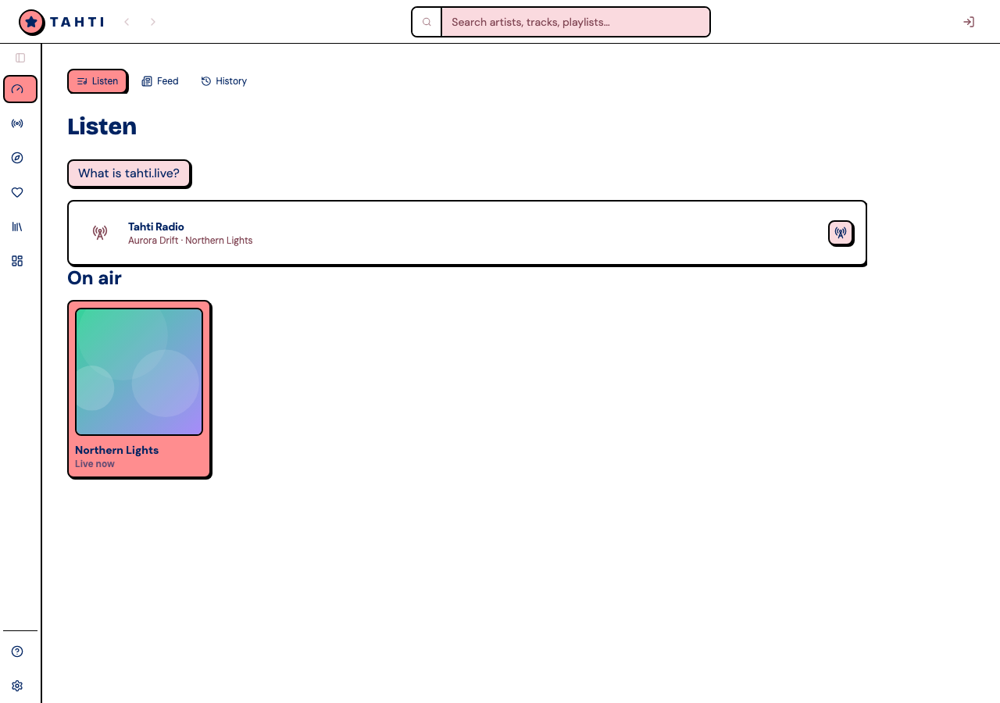
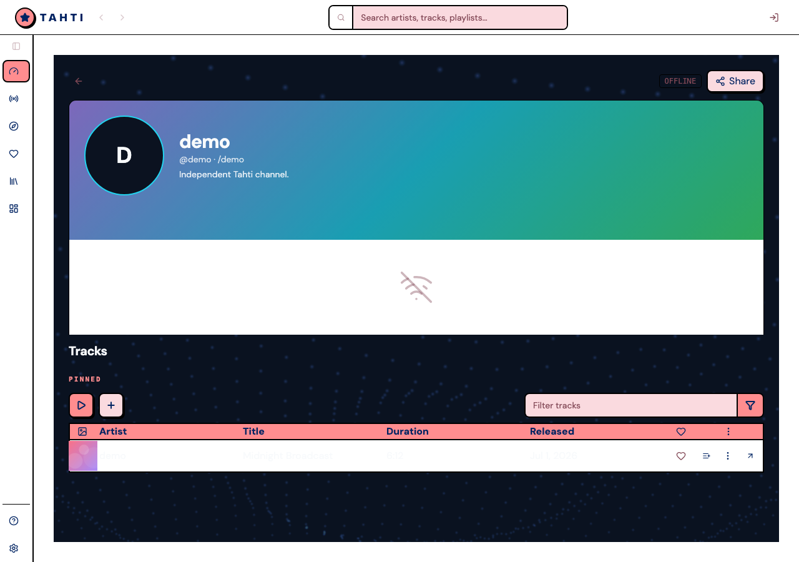
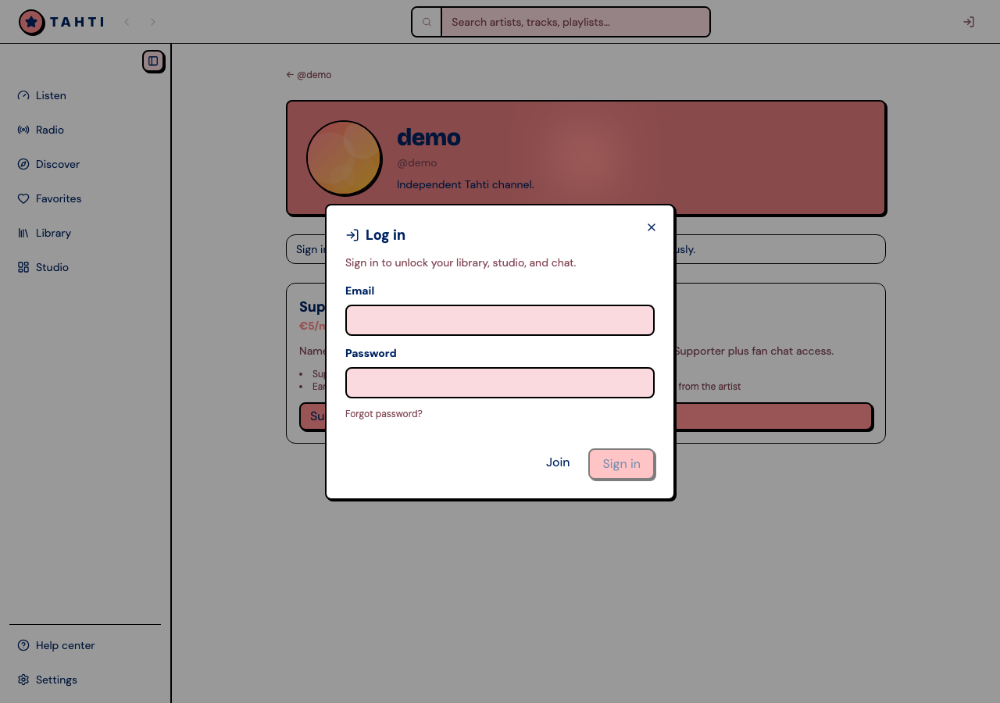
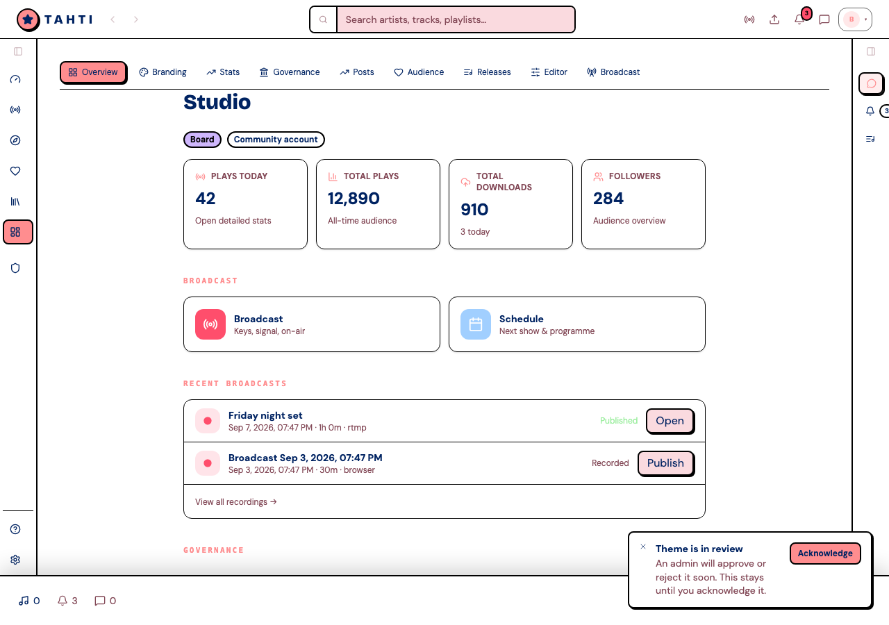
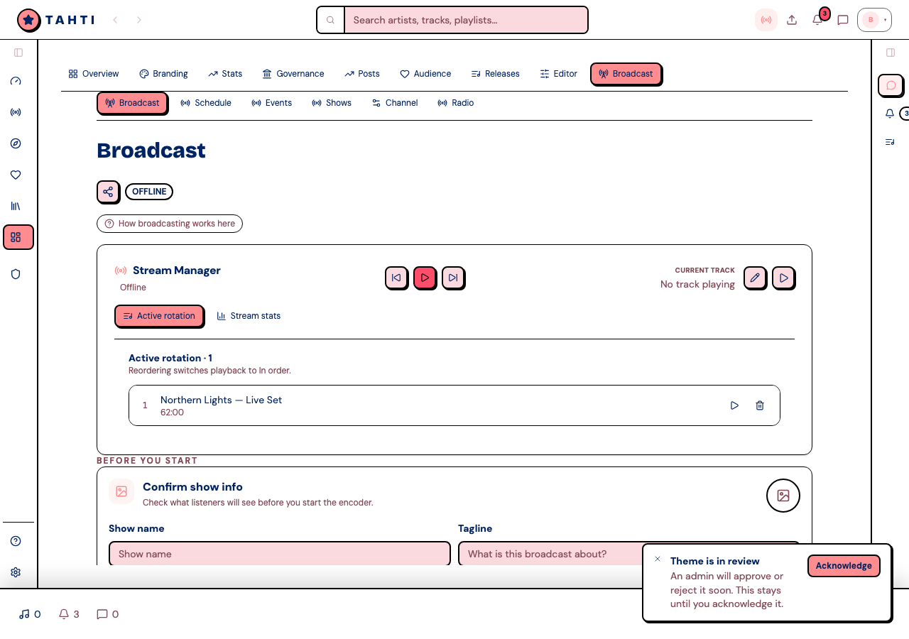
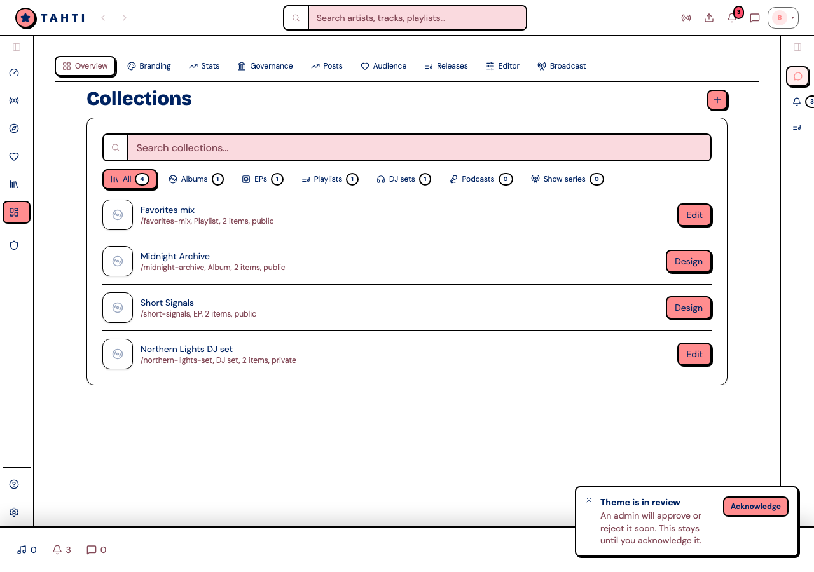
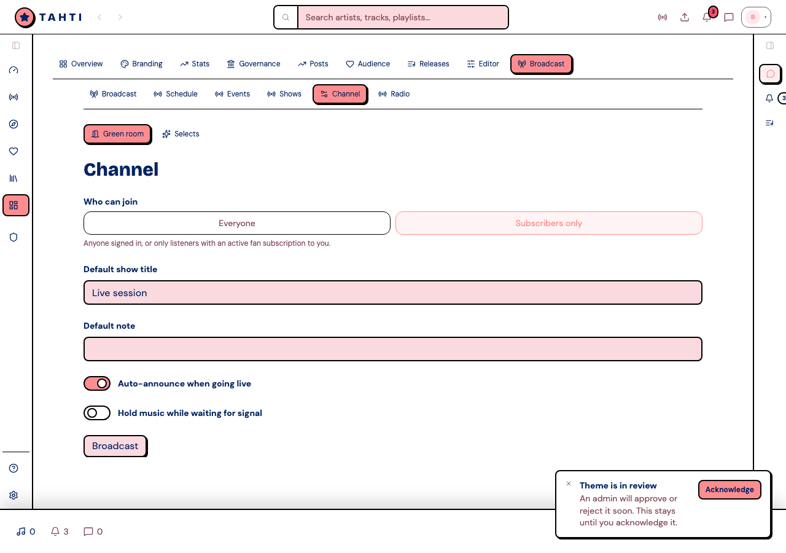
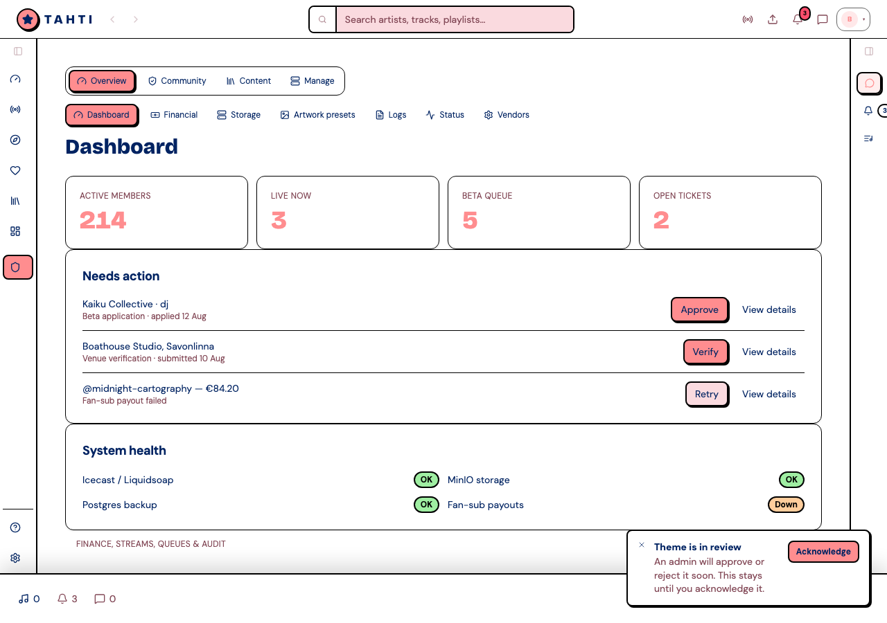

# Tahti Player

**Tahti Player** is the next listen + artist studio client for [Tahti](https://tahti.live) — a Finnish nonprofit, channel-first broadcasting platform for independent artists. It is built based on [Nuclear](https://github.com/nukeop/nuclear)’s free, ad-free and player UI (React + shared design system), and ships today as a Vite SPA on **[beta.tahti.live](https://beta.tahti.live)** against the live production API at  **[api.tahti.live](https://api.tahti.live)** 


> **API repository and full docs live under [janiluuk/tahti-org](https://github.com/janiluuk/tahti-org). See [TAHTI.md](./TAHTI.md).

## What it is

Tahti is channel-first radio and archive listening: artists broadcast live, publish music and albums, prepare audio files and earn directly from fan subscriptions, content downloads and other material. Production today still serves the Next.js app in the separate `tahti` monorepo (`apps/web` on `app.tahti.live`).

This repository holds:

1. **`@tahti-player/tahti-web`** — the Nuclear-based **listen + studio** web client (the cutover candidate for `apps/web`)
2. **Tahti Player** — the desktop app (Tauri), plugins, and shared UI packages the web client reuses

The web client is not a separate product backend. It talks to the same public Tahti API (`api.tahti.live`), chat (`chat.tahti.live`), and media CDN that production uses. Cutover planning lives in [`packages/tahti-web/CUTOVER.md`](./packages/tahti-web/CUTOVER.md).

## Why it exists

Production `apps/web` grew as a full Next stack (listen, studio, admin, marketing islands). Separate player gives Tahti a **player-native** shell: queue, themes, keyboard-friendly chrome, and a studio that feels like a desk for going live — not a generic SaaS dashboard. Also the native clients are available for Windows, Mac, and linux. These support loading your own tracks for management, enriching metadata and generic music management.

Goals:

- Modern listen UX (directory, channel HLS/archive, radio, chat, fan subscribe) on Nuclear UI
- Artist studio pillars (Go Live, library, releases, playlists/albums, channel design, schedule, stats, revenue) democked against the live API
- A clear path to replace `app.tahti.live` once route compatibility and remaining parity items land (see CUTOVER)
- Keep Nuclear’s agent/desktop heritage: shared `@tahti-player/ui` themes, plugin-oriented architecture, AGPL

Honest status: beta already covers the core listener and studio loops on live data. A few production surfaces remain partial or out of scope for Nuclear UI (board admin, full SEO/SSR, some settings depth). Tracked in [`FEATURES.md`](./packages/tahti-web/FEATURES.md).

## Features

Full prod-parity status per item lives in [`packages/tahti-web/FEATURES.md`](./packages/tahti-web/FEATURES.md); this is the reader-friendly summary.

### Listen (public, no account)

- Channel directory, live channel (HLS) + archive replay, Tahti Radio 24/7 stream
- Channel chat (Centrifugo WS, reactions, subscriber-only gating, hCaptcha on anonymous join)
- Artist profiles, collections/albums, smart links, embeds (channel / release / collection)
- Venue directory + venue registration, governance (public motions), transparency reports, platform status
- Help center, disco-widgets on listen/profile/channel

### Listener account

- Follows, favorites, listening history, add-to-playlist from anywhere (player bar, tables)
- Fan subscribe (Stripe Checkout) + manage subscriptions
- DMs, member governance voting
- Library: sounds, collections, recordings, smart links, history, favorites

### Artist studio — publish & broadcast

- Studio home, Go Live wizard (OBS/RTMP + multistream)
- Music library, upload, releases & album designer, playlists/collections
- Pro audio editor (trim/master), stash
- Schedule / 24/7 programme, radio slots & shows (series + episodes)
- Channel designer (visual presets, layers, backdrop, gallery, press kit)
- Stats (summary + detail), Updates/newsletter posts
- Revenue: fan tiers, Stripe Connect payouts
- Distribution (Revelator: catalog, pay + submit, Spotify profile, royalties)
- Channel moderators, sound share links

### Operate (board admin)

- 22 admin surfaces gated on `isBoard`: dashboard, moderation queues, stream oversight, financial, governance, grants, AGM, i18n, files/storage, announcements, feature requests, support, radio submissions, and more

### Desktop player (Tauri)

- Full Nuclear-based desktop app: search, local library, plugins, themes, remote control
- Built-in MCP server for AI-agent control (playback, queue, favorites, playlists, providers) — see [MCP](#mcp-desktop-player) below

### Developers

- Same-origin `/tahti-api` proxy to the live API on beta; public OpenAPI/Scalar at [`https://api.tahti.live/api`](https://api.tahti.live/api)
- Offline mock mode (`VITE_FORCE_MOCK=1`) — every fetcher short-circuits to realistic fixture data, zero network calls

Open gaps only (not the full matrix): [`packages/tahti-web/FEATURES-REMAINING.md`](./packages/tahti-web/FEATURES-REMAINING.md).

Live beta: **https://beta.tahti.live**

## Screenshots

From `@tahti-player/tahti-web` (mock data for stable docs captures; beta uses the live API).

### Listen home



*Listen hub: library favorites, Tahti Radio, and discover.*

### Channel (live + archive)



*Public channel: live stage, pinned archive, chat rail.*

### Fan subscribe



*Fan membership tiers (Stripe Checkout on live API).*

### Studio home



*Studio overview — Go Live, schedule, music, upload, albums.*

### Go Live



*Broadcast wizard: Connect → Live → Multistream.*

### Playlists & channel design



*Playlists — organize archive tracks and releases.*



*Channel designer — look, 24/7 radio, profile, domain.*

### Board admin



*Admin dashboard — health, activity, and moderation at a glance.*

More studio captures: [`packages/tahti-web/docs/redesign-shots/`](./packages/tahti-web/docs/redesign-shots/).

## Guide

The screenshots above are highlights. For a complete, indexed screenshot gallery of every
documented screen — organized as Listener and account, Public channel and community, Artist
studio, and Administration — see the **[full view guide](./packages/tahti-web/docs/VIEW-GUIDE.md)**.
It's generated straight from the running app (mock board account, 1680×1050 captures via
[`scripts/capture-readme-guide.mjs`](./packages/tahti-web/scripts/capture-readme-guide.mjs)), so it
stays accurate as the UI changes — regenerate it after a UI change with:

```bash
VITE_FORCE_MOCK=1 pnpm --filter @tahti-player/tahti-web dev &
pnpm --filter @tahti-player/tahti-web exec node scripts/capture-readme-guide.mjs
```

For a narrower product-jobs tour (Listen → Publish → Broadcast → Connect → Operate) with the
same screenshots inline, see [`packages/tahti-web/README.md`](./packages/tahti-web/README.md#view-guide).

## Who it’s for

- **Tahti contributors** shipping the next listen / studio client (`packages/tahti-web`)
- **Developers** exploring Tahti Player’s Tauri app, plugins, and shared UI in this fork

## What’s in this repo

| Area | Package / path | Role |
|------|----------------|------|
| **Tahti web (beta)** | `@tahti-player/tahti-web` | Listen + studio UI → public Tahti API (or mocks) |
| **Desktop player** | `@tahti-player/player` | Tahti Player Tauri app (React + Rust) |
| Shared UI / themes | `@tahti-player/ui`, `themes`, … | Design system used by player and Tahti web |
| Plugin SDK | `@tahti-player/plugin-sdk` | Plugin API (published upstream to npm) |

pnpm + Turborepo. Package manager: `pnpm@10.33.4` (see root `package.json`).

Feature checklist: [`packages/tahti-web/FEATURES.md`](./packages/tahti-web/FEATURES.md). Cutover: [`packages/tahti-web/CUTOVER.md`](./packages/tahti-web/CUTOVER.md). Package README: [`packages/tahti-web/README.md`](./packages/tahti-web/README.md).

## Prerequisites

- **Node.js** — `.node-version` pins **24** (`engines.node` `>=24`)
- **pnpm** 10.x (`corepack enable` or install via npm)
- For the **desktop player only**: [Tauri 2](https://v2.tauri.app/start/prerequisites/) system deps + **Rust** ≥ 1.77.2

Tahti web (`pnpm dev:tahti`) does **not** require Rust/Tauri.

## Install

```bash
git clone https://github.com/janiluuk/tahti-player.git
cd tahti-player
pnpm install
```

## Run / develop

```bash
# Tahti listen + studio → http://localhost:5180
pnpm dev:tahti

# Offline demo (no API); login: demo@tahti.live / any password
VITE_FORCE_MOCK=1 pnpm dev:tahti

# Tahti Player (Tauri desktop app)
pnpm dev

# Player with Vite bound to 0.0.0.0 (remote-control UI from other devices)
pnpm dev:remote

# Storybook
pnpm storybook
```

## Build / quality

```bash
pnpm build          # all packages
pnpm tauri build    # desktop app (see AGENTS.md)
pnpm lint
pnpm type-check
pnpm test
```

## Configuration (Tahti web)

Copy and edit env from [`packages/tahti-web/.env.example`](./packages/tahti-web/.env.example):

| Variable | Purpose |
|----------|---------|
| `VITE_TAHTI_API_PROXY_TARGET` | Dev proxy target (default `http://localhost:15011`) |
| `VITE_TAHTI_API_URL` | Absolute API base (dev/CORS only; leave unset in prod → same-origin `/tahti-api`) |
| `VITE_FORCE_MOCK=1` | Offline mock mode |
| `VITE_ALLOW_MOCK_FALLBACK` | Silent mock when API fails (default on in Vite dev, off in prod builds) |
| `VITE_CENTRIFUGO_WS` | Chat websocket (prod default `wss://chat.tahti.live/...`) |
| `VITE_HCAPTCHA_SITEKEY` | Optional chat gate |
| `VITE_HOST` | Vite bind host (e.g. `0.0.0.0`) |

More: [`packages/tahti-web/MOCKS.md`](./packages/tahti-web/MOCKS.md), [`packages/tahti-web/README.md`](./packages/tahti-web/README.md).

### Beta deploy

```bash
pnpm deploy:tahti-beta
```

Publishes the Tahti web build for `beta.tahti.live` (vimage / Pi proxy). See [`packages/tahti-web/deploy/README.md`](./packages/tahti-web/deploy/README.md).

## MCP (desktop player)

Tahti Player ships with a built-in [MCP](https://modelcontextprotocol.io/) server, preserved byte-identical from upstream Nuclear — it lets an AI agent control playback, queue, favorites, playlists, and providers.

1. Run the desktop player: `pnpm dev`
2. Settings → Integrations → **Enable MCP Server** (binds `http://127.0.0.1:8800/mcp`, localhost only)
3. Point your tool at it with **Streamable HTTP**:

```bash
# Claude Code
claude mcp add tahti-player --transport http http://127.0.0.1:8800/mcp

# Codex CLI
codex mcp add tahti-player --url http://127.0.0.1:8800/mcp
```

Full docs: [`packages/docs/integrations/mcp-server.md`](./packages/docs/integrations/mcp-server.md) (tool reference, OpenCode/Cursor/Windsurf/MCP Inspector setup, agent skill download). This is a **desktop-only** capability — the Vite SPA (`@tahti-player/tahti-web`) can't host the localhost control-plane bridge a CDN-served multi-user app would need; see [`packages/tahti-web/docs/MCP.md`](./packages/tahti-web/docs/MCP.md) for why.

## Relation to Tahti

| This repo | Production Tahti monorepo |
|-----------|---------------------------|
| Next listen+studio client on Nuclear UI (`beta.tahti.live`) | `apps/web` + API/worker at the `tahti` workspace |
| Same public API / chat / CDN | Full product stack, Swarm, board admin |
| Cutover plan: `packages/tahti-web/CUTOVER.md` | Pointer: `ops/nuclear-web-cutover.md` |

Public API docs (Scalar + OpenAPI): [`https://api.tahti.live/api`](https://api.tahti.live/api). Remotes and sync notes: [TAHTI.md](./TAHTI.md).

## Agents & contributing

- **AI agents:** follow [AGENTS.md](./AGENTS.md) (commands, packages, code style, Rust layout, testing).
- Upstream Nuclear does not take direct app PRs; prefer plugins for Nuclear itself. This fork is for Tahti work — coordinate with the maintainers before large changes.
- Skills under `.agents/skills/` (components, plugins, host pattern, docs).

## License

[AGPL-3.0-only](./LICENSE) — same as Nuclear upstream.
