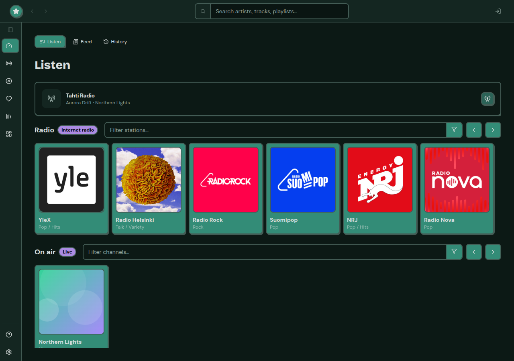
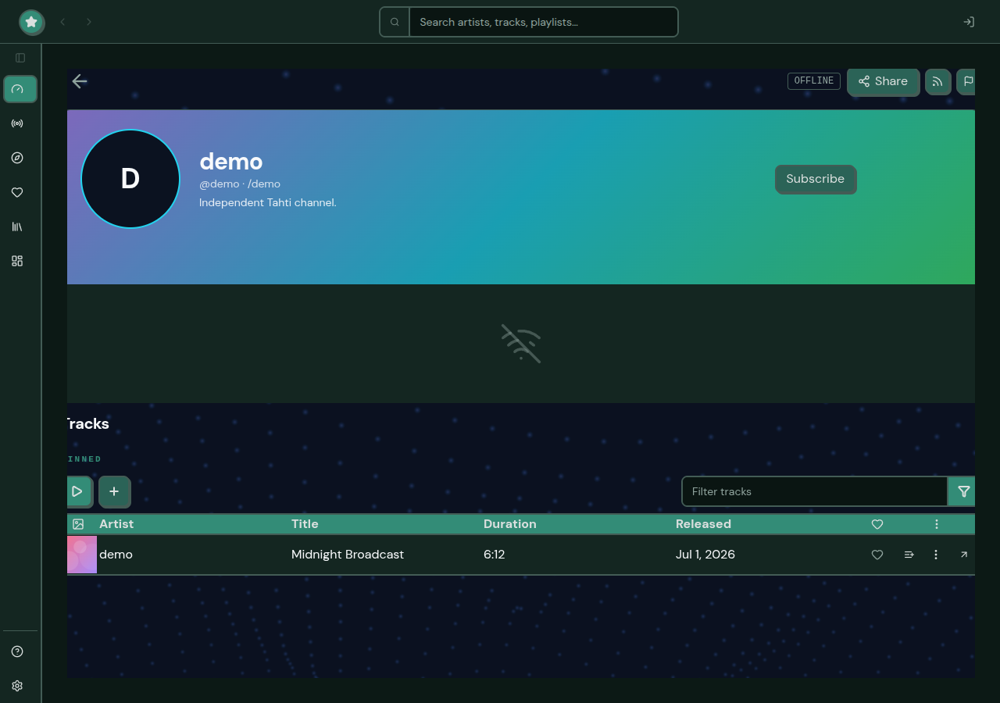
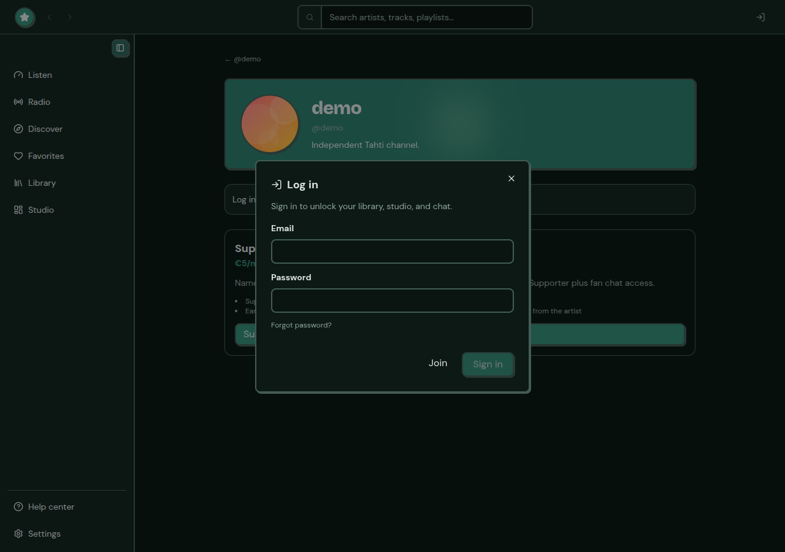
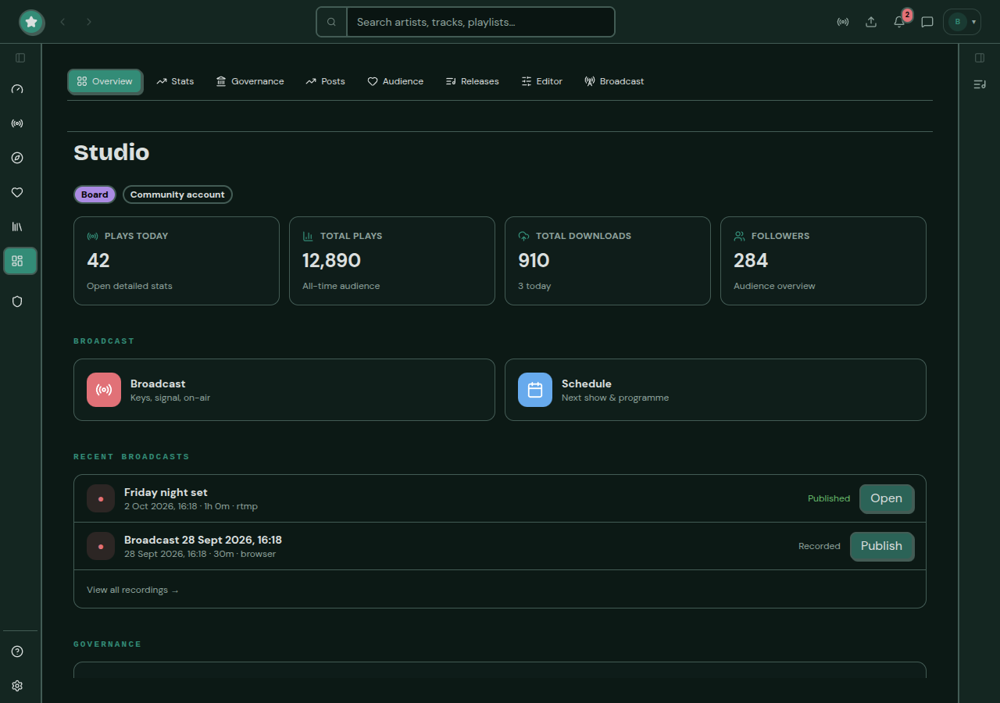
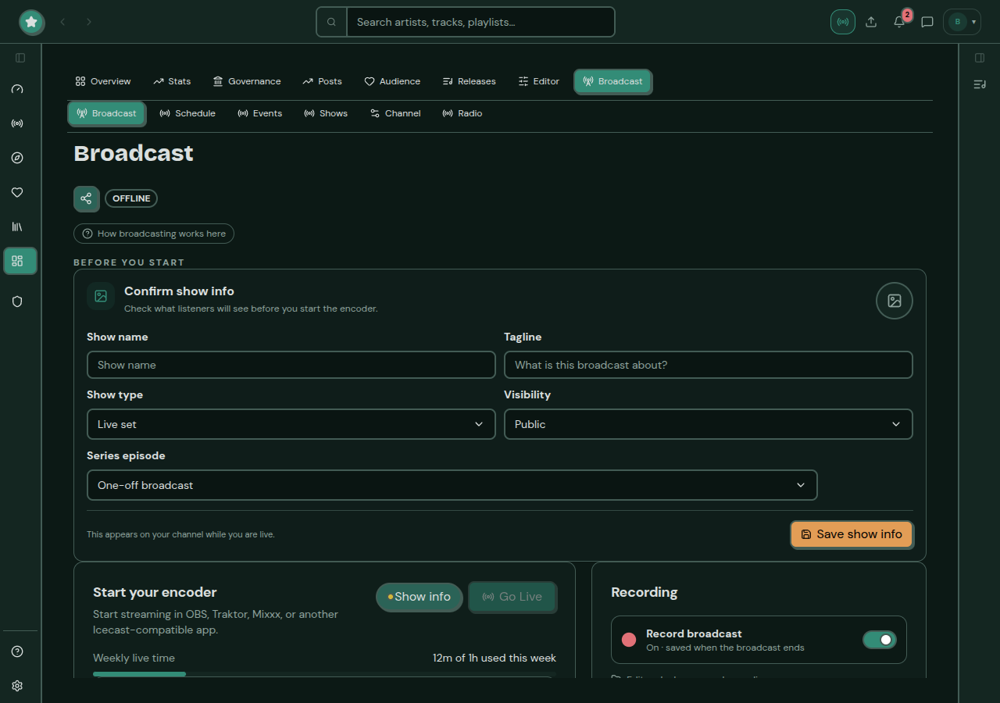
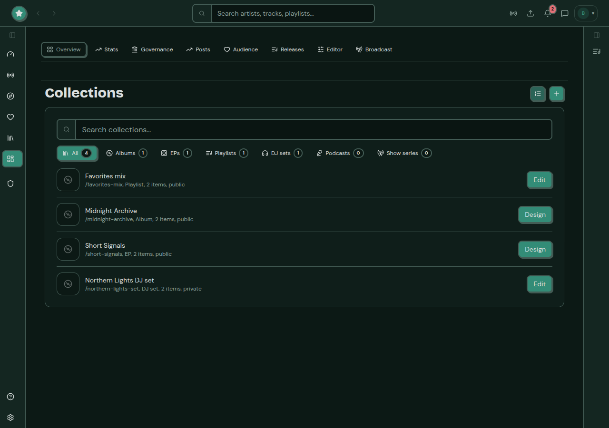
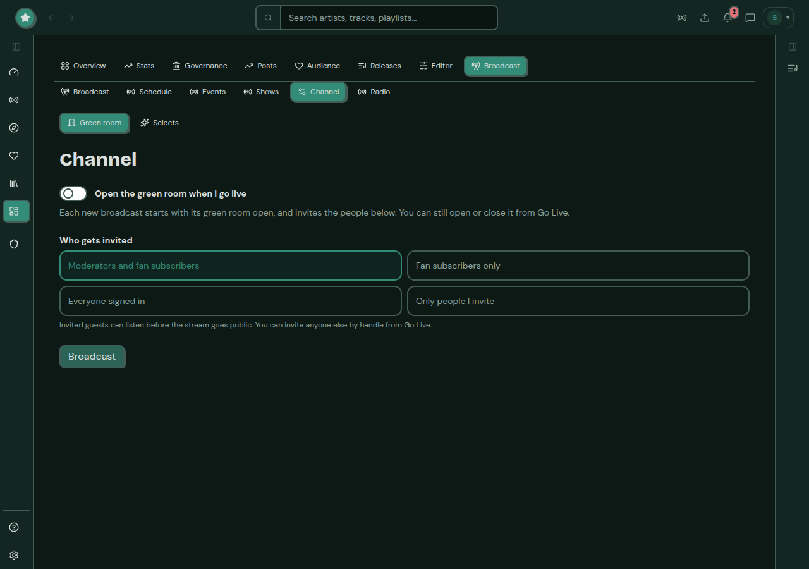
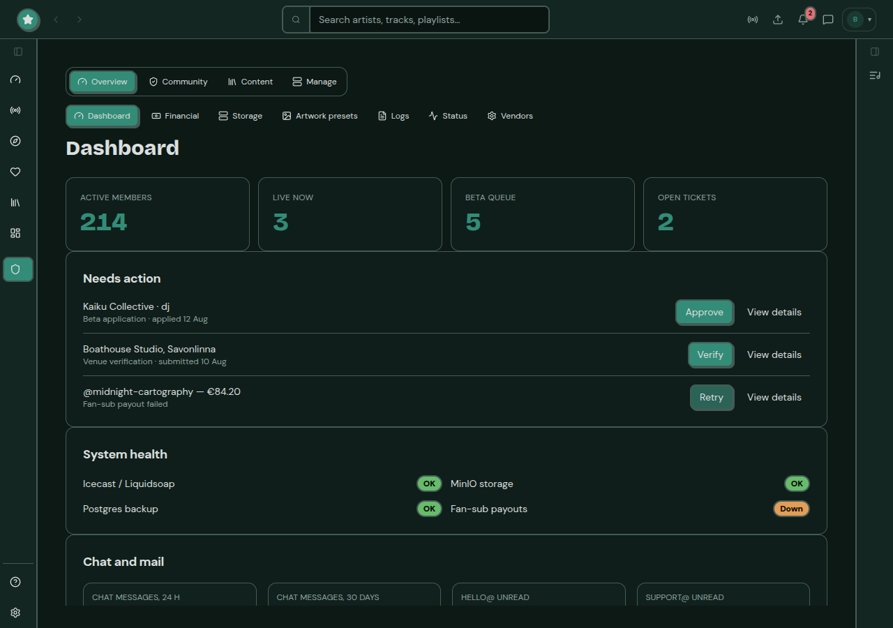

# Tahti Player

**Tahti Player** is the next listen + artist studio client for [Tahti](https://tahti.live) — a Finnish nonprofit, channel-first broadcasting platform for independent artists. Built on [Nuclear](https://github.com/nukeop/nuclear)’s player UI (React + shared design system).

| Live surface | URL |
| --- | --- |
| **Beta web (this repo)** | **[beta.tahti.live](https://beta.tahti.live)** |
| **Production API** | [api.tahti.live](https://api.tahti.live) |
| **Production web (Next.js)** | [tahti.live](https://tahti.live) — still `apps/web` in [tahti-org](https://github.com/janiluuk/tahti-org) |

> Platform API, constitution, and production stack: **[janiluuk/tahti-org](https://github.com/janiluuk/tahti-org)**. Remotes/sync: [TAHTI.md](./TAHTI.md). Doc accuracy notes: [`docs/DOC-AUDIT.md`](./docs/DOC-AUDIT.md).

## Current state

| Piece | Status |
| --- | --- |
| **`@tahti-player/tahti-web`** | Beta listen + studio SPA against **live** `api.tahti.live` (most paths `live-api`) |
| **Desktop Tauri player** | Installers/builds for Win / macOS / Linux when CI artifacts are published — local library, plugins, themes, MCP, MPD/Jam (verify latest release assets before assuming every OS build is current) |
| **Mobile** | **Responsive web only** (bottom nav, safe-area player). `scripts/build-and-run-android.sh` is an experimental Tauri Android init — **not** a store app |
| **Cutover** | Production remains Next.js until P0s land — [`CUTOVER.md`](./packages/tahti-web/CUTOVER.md) |
| **Parity matrix** | [`FEATURES.md`](./packages/tahti-web/FEATURES.md) |
| **Open gaps only** | [`FEATURES-REMAINING.md`](./packages/tahti-web/FEATURES-REMAINING.md) — multitrack timeline, Buy UX, cutover, … |

This repo is **not** a separate backend. Web + desktop talk to the same public API, chat (`chat.tahti.live`), and media stack as production.

## Why it exists

Production `apps/web` in tahti-org grew as a full Next stack. This player gives Tahti a **player-native** shell: queue, themes, keyboard-friendly chrome, and a studio that feels like a desk for going live — plus desktop crate tools Nuclear already had.

## Platform matrix (honest)

| Capability | Web (beta) | Desktop | Mobile web |
| --- | --- | --- | --- |
| Channel live / archive / radio / chat | Shipped | Via shared SPA when embedded | Responsive |
| Artist studio (Go Live, upload, releases, …) | Mostly live-api | Same SPA chrome | Usable but desk-oriented |
| Fan-subs / DMs / governance | Shipped | Same SPA | Responsive |
| Board admin | Partial (~22 surfaces; Next admin denser) | Same SPA | Partial |
| Local library / SQLite crate | Session File API only | Shipped | Absent |
| Plugin marketplace (Nuclear) | In-app add-ons subset | Full registry | Absent |
| MCP / MPD / Discord RPC | Desktop-only | Shipped | Absent |
| Chromecast / AirPlay | Absent | Absent | Absent |
| Native store packaging | — | Desktop installers | Android stub only |

## Features (reader summary)

Full prod-parity rows: [`FEATURES.md`](./packages/tahti-web/FEATURES.md).

### Listen (public)

- Channel directory, live HLS + archive replay, Tahti Radio + curated stations
- Channel chat (Centrifugo, reactions, fan gates, hCaptcha on anonymous join)
- Profiles, collections/albums, smart links, embeds
- Venues, governance (public motions), transparency, help, disco-widgets
- Tahti Jam (synced group listening) on web

### Listener account

- Follows, favorites, history, add-to-playlist from the player bar
- Fan subscribe (Stripe Checkout) + manage subs
- DMs, member governance voting
- Library hub (sounds, collections, recordings, smart links)

### Artist studio

- Studio home, Go Live (OBS/RTMP + multistream + green room)
- Upload, library, releases & album designer, playlists/collections, stash
- Pro audio editor (trim/EQ/dynamics/revisions — **not** full multitrack yet)
- Schedule / 24/7 programme, shows & radio slots
- Channel designer (visualizers, looks, press kit)
- Stats, updates/newsletter, fan tiers, Stripe Connect
- Distribution UI (Revelator) — ops credentials may still be partial on the API side
- Channel moderators, sound share links (partial backend)

### Board admin

- `isBoard`-gated surfaces (moderation, streams, financial, governance, grants, AGM, radio, …). Intentionally thinner than production Next `/admin`.

### Desktop-only power tools

- Local library + metadata enrichment, Nuclear search providers
- Plugins & themes from [tahti-registry](https://github.com/janiluuk/tahti-registry)
- MCP server for AI agents — [MCP](#mcp-desktop-player)

### Developers

- Same-origin `/tahti-api` proxy; OpenAPI/Scalar at [api.tahti.live/api](https://api.tahti.live/api)
- Offline mock mode: `VITE_FORCE_MOCK=1`
- Read-only CLI package: [`packages/tahti-cli`](./packages/tahti-cli) (also [janiluuk/tahti-cli](https://github.com/janiluuk/tahti-cli))

Live beta: **https://beta.tahti.live**

## Build and launch the desktop player

From the repository root, compile the Tauri player without creating installer
bundles and launch the resulting development binary:

```bash
pnpm player:build:run
```

The helper is at [`scripts/build-and-run-player.sh`](./scripts/build-and-run-player.sh)
and accepts arguments that are passed to the player process. The existing
`pnpm player:run` command launches an already-built Linux binary without
compiling it first. Release, Flatpak, AUR, and deployment helpers live under
`scripts/`; package-local capture and deploy helpers remain beside their
package-specific assets.

## Screenshots

From `@tahti-player/tahti-web` (mock data for stable docs captures; beta uses the live API).

### Listen home

<picture><source media="(prefers-color-scheme: light)" srcset="./packages/tahti-web/docs/redesign-shots/listen-home-v1--light.png" /></picture>

*Listen hub: library favorites, Tahti Radio, and discover.*

### Channel (live + archive)

<picture><source media="(prefers-color-scheme: light)" srcset="./packages/tahti-web/docs/redesign-shots/listen-channel-v1--light.png" /></picture>

*Public channel: live stage, pinned archive, chat rail.*

### Fan subscribe

<picture><source media="(prefers-color-scheme: light)" srcset="./packages/tahti-web/docs/redesign-shots/subscribe-v1--light.png" /></picture>

*Fan membership tiers (Stripe Checkout on live API).*

### Studio home

<picture><source media="(prefers-color-scheme: light)" srcset="./packages/tahti-web/docs/redesign-shots/studio-home-v1--light.png" /></picture>

*Studio overview — Go Live, schedule, music, upload, albums.*

### Go Live

<picture><source media="(prefers-color-scheme: light)" srcset="./packages/tahti-web/docs/redesign-shots/studio-go-live-v1--light.png" /></picture>

*Broadcast wizard: Connect → Live → Multistream.*

### Playlists & channel design

<picture><source media="(prefers-color-scheme: light)" srcset="./packages/tahti-web/docs/redesign-shots/studio-playlists-v1--light.png" /></picture>

*Playlists — organize archive tracks and releases.*

<picture><source media="(prefers-color-scheme: light)" srcset="./packages/tahti-web/docs/redesign-shots/studio-channel-v1--light.png" /></picture>

*Channel designer — look, 24/7 radio, profile, domain.*

### Board admin

<picture><source media="(prefers-color-scheme: light)" srcset="./packages/tahti-web/docs/redesign-shots/admin-dashboard-current-v1--light.png" /></picture>

*Admin dashboard — health, activity, and moderation at a glance (current capture).*

More captures: [`packages/tahti-web/docs/redesign-shots/`](./packages/tahti-web/docs/redesign-shots/) · full indexed gallery: [`VIEW-GUIDE.md`](./packages/tahti-web/docs/VIEW-GUIDE.md). Regenerate after UI changes (see Guide below). Mock captures are for docs stability; beta uses the live API.

## Guide

The screenshots above are highlights. For a complete, indexed screenshot gallery of every
documented screen — organized as Listener and account, Public channel and community, Artist
studio, and Administration — see the **[full view guide](./packages/tahti-web/docs/VIEW-GUIDE.md)**.
It's generated straight from the running app (mock board account, 1680×1050 captures via
[`scripts/capture-readme-guide.mjs`](./packages/tahti-web/scripts/capture-readme-guide.mjs)), so it
stays accurate as the UI changes — regenerate it after a UI change with:

```bash
VITE_FORCE_MOCK=1 pnpm --filter @tahti-player/tahti-web dev &
pnpm --filter @tahti-player/tahti-web exec node scripts/capture-readme-guide.mjs
```

For a narrower product-jobs tour (Listen → Publish → Broadcast → Connect → Operate) with the
same screenshots inline, see [`packages/tahti-web/README.md`](./packages/tahti-web/README.md#view-guide).

## Who it’s for

- **Tahti contributors** shipping the next listen / studio client (`packages/tahti-web`)
- **Developers** exploring Tahti Player’s Tauri app, add-ons, and shared UI in this fork

## What’s in this repo

| Area | Package / path | Role |
|------|----------------|------|
| **Tahti web (beta)** | `@tahti-player/tahti-web` | Listen + studio UI → public Tahti API (or mocks) |
| **Desktop player** | `@tahti-player/player` | Tauri app (React + Rust) |
| Shared UI / themes | `@tahti-player/ui`, `themes`, … | Design system |
| Plugin SDK / registry host | `@tahti-player/plugin-sdk`, `plugin-registry` | Nuclear plugins; public index at [tahti-registry](https://github.com/janiluuk/tahti-registry) |
| CLI | `@tahti-player/tahti-cli` | Read-only API client (whoami, library, releases, search) |

pnpm + Turborepo. Package manager: `pnpm@12.5.1` (see root `package.json` `packageManager` field).

Feature checklist: [`packages/tahti-web/FEATURES.md`](./packages/tahti-web/FEATURES.md). Cutover: [`packages/tahti-web/CUTOVER.md`](./packages/tahti-web/CUTOVER.md). Package README: [`packages/tahti-web/README.md`](./packages/tahti-web/README.md).

## Prerequisites

- **Node.js** — `.node-version` pins **24** (`engines.node` `>=24`)
- **pnpm** 12.x via `corepack enable` (matches `packageManager` in root `package.json`)
- For the **desktop player only**: [Tauri 2](https://v2.tauri.app/start/prerequisites/) system deps + **Rust** ≥ 1.77.2

Tahti web (`pnpm dev:tahti`) does **not** require Rust/Tauri.

## Install

```bash
git clone https://github.com/janiluuk/tahti-player.git
cd tahti-player
pnpm install
```

## Run / develop

```bash
# Tahti listen + studio → http://localhost:5180
pnpm dev:tahti

# Offline demo (no API); login: demo@tahti.live / any password
VITE_FORCE_MOCK=1 pnpm dev:tahti

# Tahti Player (Tauri desktop app)
pnpm dev

# Player with Vite bound to 0.0.0.0 (remote-control UI from other devices)
pnpm dev:remote

# Storybook
pnpm storybook
```

## Build / quality

```bash
pnpm build          # all packages
pnpm tauri build    # desktop app (see AGENTS.md)
pnpm lint
pnpm type-check
pnpm test
```

## Configuration (Tahti web)

Copy and edit env from [`packages/tahti-web/.env.example`](./packages/tahti-web/.env.example):

| Variable | Purpose |
|----------|---------|
| `VITE_TAHTI_API_PROXY_TARGET` | Dev proxy target (default `http://localhost:15011`) |
| `VITE_TAHTI_API_URL` | Absolute API base (dev/CORS only; leave unset in prod → same-origin `/tahti-api`) |
| `VITE_FORCE_MOCK=1` | Offline mock mode |
| `VITE_ALLOW_MOCK_FALLBACK` | Silent mock when API fails (default on in Vite dev, off in prod builds) |
| `VITE_CENTRIFUGO_WS` | Chat websocket (prod default `wss://chat.tahti.live/...`) |
| `VITE_HCAPTCHA_SITEKEY` | Optional chat gate |
| `VITE_HOST` | Vite bind host (e.g. `0.0.0.0`) |

More: [`packages/tahti-web/MOCKS.md`](./packages/tahti-web/MOCKS.md), [`packages/tahti-web/README.md`](./packages/tahti-web/README.md).

### Beta deploy

```bash
pnpm deploy:tahti-beta
```

Publishes the Tahti web build for `beta.tahti.live` (vimage / Pi proxy). See [`packages/tahti-web/deploy/README.md`](./packages/tahti-web/deploy/README.md).

## MCP (desktop player)

Tahti Player ships with a built-in [MCP](https://modelcontextprotocol.io/) server, preserved byte-identical from upstream Nuclear — it lets an AI agent control playback, queue, favorites, playlists, and providers.

1. Run the desktop player: `pnpm dev`
2. Settings → Integrations → **Enable MCP Server** (binds `http://127.0.0.1:8800/mcp`, localhost only)
3. Point your tool at it with **Streamable HTTP**:

```bash
# Claude Code
claude mcp add tahti-player --transport http http://127.0.0.1:8800/mcp

# Codex CLI
codex mcp add tahti-player --url http://127.0.0.1:8800/mcp
```

Full docs: [`packages/docs/integrations/mcp-server.md`](./packages/docs/integrations/mcp-server.md) (tool reference, OpenCode/Cursor/Windsurf/MCP Inspector setup, agent skill download). This is a **desktop-only** capability — the Vite SPA (`@tahti-player/tahti-web`) can't host the localhost control-plane bridge a CDN-served multi-user app would need; see [`packages/tahti-web/docs/MCP.md`](./packages/tahti-web/docs/MCP.md) for why.

## Relation to Tahti

| This repo | Production Tahti monorepo |
|-----------|---------------------------|
| Next listen+studio client on Nuclear UI (`beta.tahti.live`) | `apps/web` + API/worker at the `tahti` workspace |
| Same public API / chat / CDN | Full product stack, Swarm, board admin |
| Cutover plan: `packages/tahti-web/CUTOVER.md` | Pointer: `ops/nuclear-web-cutover.md` |

Public API docs (Scalar + OpenAPI): [`https://api.tahti.live/api`](https://api.tahti.live/api). Remotes and sync notes: [TAHTI.md](./TAHTI.md). System architecture and diagrams: [`docs/ARCHITECTURE.md`](./docs/ARCHITECTURE.md), [`docs/DATA-FLOW.md`](./docs/DATA-FLOW.md).

## Agents & contributing

- **AI agents:** follow [AGENTS.md](./AGENTS.md) (commands, packages, code style, Rust layout, testing).
- Upstream Nuclear does not take direct app PRs; prefer plugins for Nuclear itself. This fork is for Tahti work — coordinate with the maintainers before large changes.
- Skills under `.agents/skills/` (components, plugins, host pattern, docs).

## License

[AGPL-3.0-only](./LICENSE) — same as Nuclear upstream.
