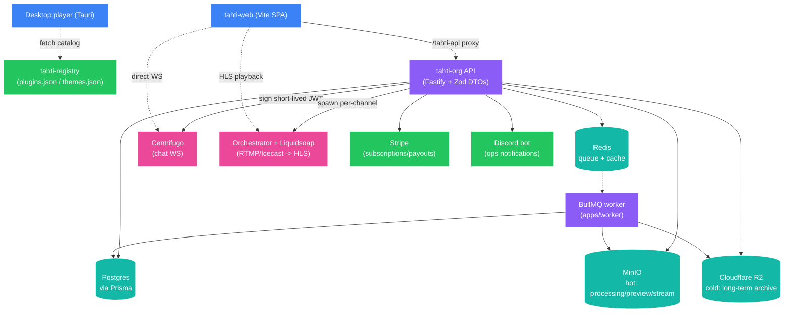

# Architecture

System-level overview: what talks to what, and why. For how a specific
request/upload/broadcast actually moves through these pieces step by step,
see [`DATA-FLOW.md`](./DATA-FLOW.md).

## Repos

| Repo | Role |
| --- | --- |
| **`tahti-player`** (this repo) | Desktop player (Tauri) + `tahti-web` (listen/studio SPA) + shared UI/plugin/theme packages. No server code. |
| **`../tahti-org`** | Fastify API, Prisma/Postgres, BullMQ worker, and the legacy Next.js `apps/web` client this fork is replacing. |
| **`../tahti-registry`** | Static JSON catalog (`plugins.json`, `themes.json`) for the desktop player's marketplace — fetched directly from `raw.githubusercontent.com`, no CDN layer. |

## System

## Clients

- **`tahti-web`** is a pure Vite SPA — no server of its own. In production it
  calls the API same-origin through a `/tahti-api` proxy; in dev, either that
  proxy (`VITE_TAHTI_API_PROXY_TARGET`) or an absolute URL
  (`VITE_TAHTI_API_URL`, CORS). `VITE_FORCE_MOCK=1` short-circuits every
  fetcher to fixture data — no network calls, no API needed.
- **Desktop player** is Tauri (Rust + React): local library, unsandboxed
  plugins, and a built-in MCP server (localhost only, `127.0.0.1:8800/mcp`)
  that lets an AI agent drive playback/queue/favorites. It fetches the
  plugin/theme marketplace catalog directly from `tahti-registry` on GitHub —
  that path never touches the Tahti API.

## API & data

Fastify + Prisma/Postgres is the system of record. Redis backs both the
BullMQ job queue and general caching. Object storage is split by
temperature, sharing one S3-compatible client shape
(`apps/api/src/lib/{minio,r2}.ts` in `tahti-org`):

- **MinIO** — hot reads: processing, preview, active streaming.
- **Cloudflare R2** — cold, long-term store.

## Live broadcast

An artist's encoder (OBS or any RTMP/Icecast source) pushes to an ingest
host; the API asks a separate **orchestrator** service to spawn a
per-channel **Liquidsoap** process, which produces the HLS output (plus
multistream) that listeners actually play. Chat is a parallel path: the API
signs a short-lived HS256 JWT and the client uses it to connect **directly**
to Centrifugo's websocket — chat traffic never round-trips through the API
after that handshake.

## Background jobs

The BullMQ worker (`tahti-org/apps/worker`) drains jobs off Redis:
transcoding, waveform/editor-peaks generation, audio fingerprinting
(ACRCloud/AcoustID — powers tracklist auto-identification), stem separation,
newsletter/social-post dispatch, ledger rollups and fan-sub payouts, and
scheduled sweeps (expired stems, missed live shows). None of this runs
inline in an API request — uploads/edits land in Postgres in a `PROCESSING`
state and flip to `READY` (or `FAILED`) once the matching job finishes.

## Reference

- [`DATA-FLOW.md`](./DATA-FLOW.md) — the same system, traced through three
  concrete flows (listen, studio publish, go-live).
- [`../TAHTI.md`](../TAHTI.md) — product framing and repo relationship.
- [`../AGENTS.md`](../AGENTS.md) / [`../AGENTS-START-HERE.md`](../AGENTS-START-HERE.md) — where to work in this repo.
