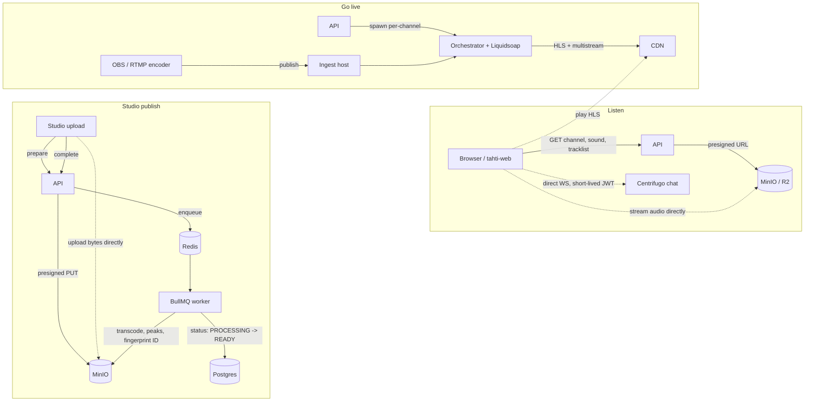

# Data flow

One thesis: **the API is the hub.** Every client reads and writes through
it; it's the only thing that talks to Postgres, and it's what hands out the
short-lived credentials (presigned upload URLs, Centrifugo JWTs) that let
clients then talk to storage and chat *directly*, without the API in the
loop for every byte.

The same flow in words:

- **Listen** — `tahti-web` asks the API for what to show (channel metadata,
  a sound's tracklist, a release). For anything binary, the API hands back
  a presigned URL instead of the bytes; the browser then streams audio and
  loads images straight from storage. Chat is the same pattern: the API
  signs a short JWT once, and the browser holds an open websocket to
  Centrifugo directly.
- **Studio publish** — an upload is a three-step handshake with the API
  (prepare → direct-to-storage PUT → complete), not a single big POST. The
  API's job on "complete" is just to enqueue work; a BullMQ worker (drained
  off Redis) does the actual transcoding, waveform-peaks generation, and
  audio fingerprinting, writing results back to storage and flipping the
  track's Postgres status from `PROCESSING` to `READY` (or `FAILED`) when
  it's done. Nothing in this path blocks an API request on ffmpeg.
- **Go live** — the API never touches the media stream itself. It only
  tells a separate orchestrator service to spawn a per-channel Liquidsoap
  process, which takes the artist's RTMP/Icecast source and produces the
  HLS (+ multistream) output listeners actually play from the CDN. Chat
  during a live show rides the same direct-to-Centrifugo path as Listen.

See [`ARCHITECTURE.md`](./ARCHITECTURE.md) for what each box is (and where
its code lives); this page is only about the shape of the traffic between
them.
