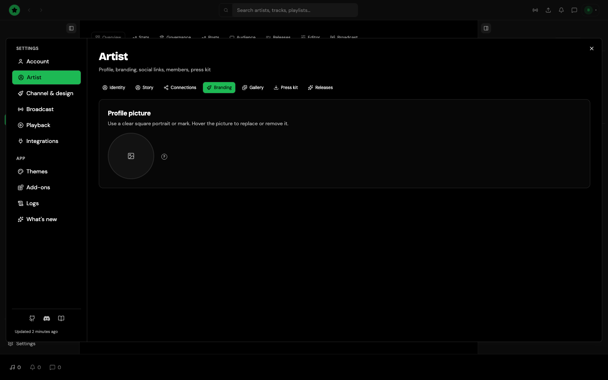

# @tahti-player/tahti-web

Tahti’s listen, artist studio and administration client. It combines the Nuclear Player experience with publishing, broadcasting, community and platform-management tools.

The [View guide](#view-guide) below shows large highlights for each main product job. The complete indexed gallery lives in [`docs/VIEW-GUIDE.md`](./docs/VIEW-GUIDE.md). Shots come from the populated mock environment with the board account ([`scripts/capture-readme-guide.mjs`](./scripts/capture-readme-guide.mjs), [`docs/readme-shots/manifest.json`](./docs/readme-shots/manifest.json)).

## What Tahti is for

- **Listen:** discover channels, releases, collections and community posts; play live radio and on-demand audio.
- **Publish:** upload sounds and clips, build releases and collections, edit metadata, create smartlinks and prepare distribution.
- **Broadcast:** schedule shows, run pre-flight and live controls, manage 24/7 rotations, recordings and stream destinations.
- **Connect:** maintain an artist profile, audience tiers, subscriptions, announcements, chat and governance participation.
- **Operate:** give administrators moderation queues, stream controls, audit logs, platform status, localization and widget management.

## View guide

Highlights of the main product jobs. Each image is a large 1680×1050 capture from the mock board account. The full indexed gallery of every documented view is in [`docs/VIEW-GUIDE.md`](./docs/VIEW-GUIDE.md) (manifest: [`docs/readme-shots/manifest.json`](./docs/readme-shots/manifest.json)).

### Listen

Discover stations and catalogue, then keep listening from the persistent player.

#### Listener home

<picture><source media="(prefers-color-scheme: light)" srcset="./docs/readme-shots/listen-home--light.png" /></picture>

Browse stations, releases and the active player. · [`/`](./docs/VIEW-GUIDE.md#listen-home)

#### Radio directory

<picture><source media="(prefers-color-scheme: light)" srcset="./docs/readme-shots/listen-radio--light.png" /></picture>

Find live channels and open a station. · [`/radio`](./docs/VIEW-GUIDE.md#listen-radio)

#### Discover

<picture><source media="(prefers-color-scheme: light)" srcset="./docs/readme-shots/listen-discover--light.png" /></picture>

Explore tracks, artists and collections. · [`/discover`](./docs/VIEW-GUIDE.md#listen-discover)

#### Public channel / Aurora

<picture><source media="(prefers-color-scheme: light)" srcset="./docs/readme-shots/public-channel-aurora--light.png" /></picture>

A public artist channel with the Aurora visualizer. · [`/channel/demo`](./docs/VIEW-GUIDE.md#public-channel-aurora)

More in this area: see the [full view guide](./docs/VIEW-GUIDE.md).

### Publish

Upload, organise sounds and releases, and prepare catalogue for the public channel.

#### Studio / Library / Sounds

<picture><source media="(prefers-color-scheme: light)" srcset="./docs/readme-shots/studio-sounds--light.png" /></picture>

Filter, sort, play and edit sound content. · [`/studio/sounds`](./docs/VIEW-GUIDE.md#studio-sounds)

#### Studio / Library / Releases

<picture><source media="(prefers-color-scheme: light)" srcset="./docs/readme-shots/studio-releases--light.png" /></picture>

Manage singles, EPs and albums. · [`/studio/releases`](./docs/VIEW-GUIDE.md#studio-releases)

#### Studio / Library / Upload

<picture><source media="(prefers-color-scheme: light)" srcset="./docs/readme-shots/studio-upload--light.png" /></picture>

Add tracks, releases, clips and imports. · [`/library/upload`](./docs/VIEW-GUIDE.md#studio-upload)

#### Studio / Library / Collections

<picture><source media="(prefers-color-scheme: light)" srcset="./docs/readme-shots/studio-collections--light.png" /></picture>

Create and browse organized collections. · [`/library/collections`](./docs/VIEW-GUIDE.md#studio-collections)

More in this area: see the [full view guide](./docs/VIEW-GUIDE.md).

### Broadcast

Go live, programme the schedule, and run channel / radio controls.

#### Studio / Perform / Go live

<picture><source media="(prefers-color-scheme: light)" srcset="./docs/readme-shots/studio-go-live--light.png" /></picture>

Run pre-flight, rotation and live broadcast controls. · [`/studio/go-live`](./docs/VIEW-GUIDE.md#studio-go-live)

#### Studio / Perform / Schedule

<picture><source media="(prefers-color-scheme: light)" srcset="./docs/readme-shots/studio-schedule--light.png" /></picture>

Plan broadcasts and inspect analytics. · [`/studio/schedule`](./docs/VIEW-GUIDE.md#studio-schedule)

#### Studio / Manage / Radio

<picture><source media="(prefers-color-scheme: light)" srcset="./docs/readme-shots/studio-radio--light.png" /></picture>

Control stream statistics and 24/7 rotation. · [`/studio/channel?tab=radio`](./docs/VIEW-GUIDE.md#studio-radio)

#### Studio / Branding

<picture><source media="(prefers-color-scheme: light)" srcset="./docs/readme-shots/studio-branding--light.png" /></picture>

Design channel look, artwork and public presentation. · [`/studio/branding`](./docs/VIEW-GUIDE.md#studio-branding)

More in this area: see the [full view guide](./docs/VIEW-GUIDE.md).

### Connect

Artist identity, audience, messages and community governance.

#### Artist profile

<picture><source media="(prefers-color-scheme: light)" srcset="./docs/readme-shots/public-artist--light.png" /></picture>

See the artist identity, story, people and public catalogue. · [`/u/demo`](./docs/VIEW-GUIDE.md#public-artist)

#### Studio / Audience

<picture><source media="(prefers-color-scheme: light)" srcset="./docs/readme-shots/studio-audience--light.png" /></picture>

Manage audience relationships and fan revenue. · [`/studio/revenue`](./docs/VIEW-GUIDE.md#studio-audience)

#### Messages

<picture><source media="(prefers-color-scheme: light)" srcset="./docs/readme-shots/listener-messages--light.png" /></picture>

Open conversations and highlighted message threads. · [`/messages`](./docs/VIEW-GUIDE.md#listener-messages)

#### Governance

<picture><source media="(prefers-color-scheme: light)" srcset="./docs/readme-shots/governance--light.png" /></picture>

Review proposals, voting and community decisions. · [`/governance`](./docs/VIEW-GUIDE.md#governance)

More in this area: see the [full view guide](./docs/VIEW-GUIDE.md).

### Operate

Board tools for health, moderation queues and live stream oversight.

#### Admin / Overview

<picture><source media="(prefers-color-scheme: light)" srcset="./docs/readme-shots/admin-overview--light.png" /></picture>

Monitor platform needs action, streams and system status. · [`/admin`](./docs/VIEW-GUIDE.md#admin-overview)

#### Admin / Moderation / Support

<picture><source media="(prefers-color-scheme: light)" srcset="./docs/readme-shots/admin-moderation--light.png" /></picture>

Triage moderation queues. · [`/admin/moderation`](./docs/VIEW-GUIDE.md#admin-moderation)

#### Admin / Streams

<picture><source media="(prefers-color-scheme: light)" srcset="./docs/readme-shots/admin-streams--light.png" /></picture>

Manage streams, listeners and controls. · [`/admin/streams`](./docs/VIEW-GUIDE.md#admin-streams)

#### Admin / Status

<picture><source media="(prefers-color-scheme: light)" srcset="./docs/readme-shots/admin-status--light.png" /></picture>

View platform health alongside operational data. · [`/admin/status`](./docs/VIEW-GUIDE.md#admin-status)

More in this area: see the [full view guide](./docs/VIEW-GUIDE.md).
## Add-ons

`Settings → Add-ons` is one app-store-style browser (`PluginStorePanel.tsx`, see [`PLUGIN-STORE-PLAN.md`](./PLUGIN-STORE-PLAN.md)) over every extension point in the client, grouped here by what each group is *for* rather than where its code lives.

### Appearance

- **Themes** — the app's color palette. Built-in: Default, Aurora, Ember, Lagoon, Moss and Tahti, plus your own imported theme JSON.
- **Visualizers** — the live animated backdrop behind a channel while it's on air: Aurora, Backdrop Box, Cloudscape, IES Spotlight, Lens Flares, Line Tangle, Minimal, Particle Field, Reactive Grid, Water Ripple, Waveform Bars.

### Listen page

- **Radio** — curated internet radio stations in the main player bar, either enabled for everyone by a board admin or added by you.
- **Listen** — inline listener widgets played through the provider's own official embedded player: SoundCloud, YouTube, Spotify, hearthis.at, Bandcamp.
- **Discovery** — sandboxed, admin-curated third-party embeds on the Listen page, visible only to the listener who enables them.

### Channel and broadcast

- **Channel** — sandboxed widgets on your public channel/artist page, visible to anyone who visits.
- **Multicast** — extra RTMP destinations your live stream mirrors to: YouTube, Twitch, Facebook, Kick, TikTok, Mixcloud Live, Instagram, or a custom RTMP URL.

### Catalog and production

- **Import** — where tracks/albums come from: local upload, Stash (private locker), Bandcamp, SoundCloud, Google Drive, Mixcloud, URL/DSP paste, Spotify search, hearthis.at search, and internet radio stream URLs.
- **Export** — DSPs your releases can be delivered to via Revelator: Spotify, Apple Music, Tidal, Deezer, Amazon Music, YouTube Music; plus Bandcamp, SoundCloud, Mixcloud and hearthis.at, managed as connected accounts under Import.
- **Fingerprinting** — audio fingerprint matching for catalog metadata: AcoustID.
- **Audio plugins** — the Pro Editor's DSP chain: EQ, Compressor, Limiter, Filter.

## Running locally

```bash
pnpm dev
pnpm storybook
pnpm --filter @tahti-player/tahti-web type-check
pnpm --filter @tahti-player/tahti-web lint
```

Refresh the guide against the mock app with:

```bash
README_GUIDE_BASE_URL=http://127.0.0.1:5180 node packages/tahti-web/scripts/capture-readme-guide.mjs
```

That rewrites the README feature highlights and the full [`docs/VIEW-GUIDE.md`](./docs/VIEW-GUIDE.md) index from 1680×1050 viewport captures (mock content, reduced motion).

## Documentation and architecture

The application is a Vite/React client in a pnpm monorepo. Shared Nuclear components live in `packages/ui`; the Tahti web client lives in `packages/tahti-web`; plugin contracts and player services live in the surrounding packages. Product planning and implementation notes are kept in [`WORKPLAN.md`](./WORKPLAN.md) and [`UI-REDESIGN-WORKLOG.md`](./UI-REDESIGN-WORKLOG.md).

The API contract is documented in [`docs/API-REFERENCE.md`](./docs/API-REFERENCE.md). It is checked against `../tahti-org/openapi.json` so route and contract changes in the sibling API trigger a documentation review.
