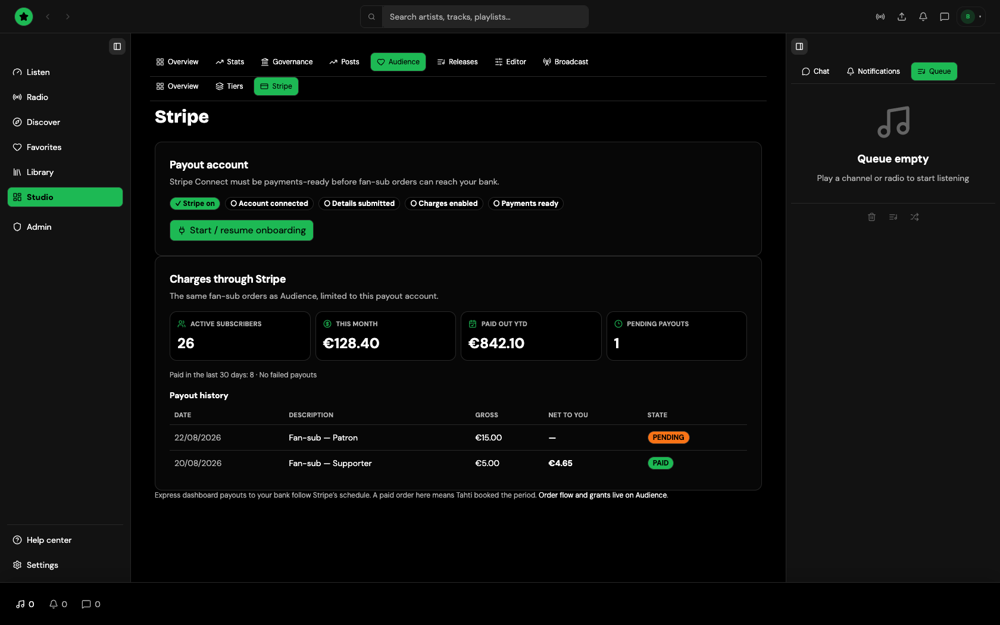

# Tahti web — full view guide

Indexed gallery of every documented route capture. Screenshots are 1680×1050 viewport shots from the populated mock environment with the board account. The README keeps [feature highlights](../README.md#view-guide) only; this page is the complete index.

Capture: [`scripts/capture-readme-guide.mjs`](../scripts/capture-readme-guide.mjs) · Manifest: [`readme-shots/manifest.json`](./readme-shots/manifest.json)

## Contents

- [Listener and account](#listener-and-account) (20)
- [Public channel and community](#public-channel-and-community) (5)
- [Artist studio](#artist-studio) (31)
- [Administration](#administration) (27)

## Listener and account

| View | Path |
| --- | --- |
| [Listener home](#listen-home) | `/` |
| [Radio directory](#listen-radio) | `/radio` |
| [Discover](#listen-discover) | `/discover` |
| [Your feed](#listen-feed) | `/feed` |
| [Library / All sounds](#library-all-sounds) | `/library` |
| [Library / Collections](#library-collections) | `/library/collections` |
| [Library / Recordings](#library-recordings) | `/library/recordings` |
| [Library / History](#library-history) | `/library/history` |
| [Library / Favourites](#library-favorites) | `/library/favorites` |
| [Library / Smartlinks](#library-smartlinks) | `/library/smartlinks` |
| [Messages](#listener-messages) | `/messages` |
| [Settings / Account](#settings-account) | `/settings/account` |
| [Settings / Artist](#settings-artist) | `/settings/artist` |
| [Settings / Channel](#settings-channel) | `/settings/channel` |
| [Settings / Broadcast](#settings-broadcast) | `/settings/broadcast` |
| [Settings / Audience](#settings-audience) | `/settings/audience` |
| [Settings / Themes](#settings-themes) | `/settings/themes` |
| [Settings / Add-ons](#settings-addons) | `/settings/plugin-store` |
| [Settings / What’s new](#settings-whats-new) | `/settings/whats-new` |
| [Artist profile](#public-artist) | `/u/demo` |

### Listener home

<picture><source media="(prefers-color-scheme: light)" srcset="./readme-shots/listen-home--light.png" /></picture>

Browse stations, releases and the active player.

`/`

### Radio directory

<picture><source media="(prefers-color-scheme: light)" srcset="./readme-shots/listen-radio--light.png" /></picture>

Find live channels and open a station.

`/radio`

### Discover

<picture><source media="(prefers-color-scheme: light)" srcset="./readme-shots/listen-discover--light.png" /></picture>

Explore tracks, artists and collections.

`/discover`

### Your feed

<picture><source media="(prefers-color-scheme: light)" srcset="./readme-shots/listen-feed--light.png" /></picture>

Follow updates and play shared tracks.

`/feed`

### Library / All sounds

<picture><source media="(prefers-color-scheme: light)" srcset="./readme-shots/library-all-sounds--light.png" /></picture>

Manage uploaded audio with search, filters and playback.

`/library`

### Library / Collections

<picture><source media="(prefers-color-scheme: light)" srcset="./readme-shots/library-collections--light.png" /></picture>

Organize albums, EPs, playlists and podcasts.

`/library/collections`

### Library / Recordings

<picture><source media="(prefers-color-scheme: light)" srcset="./readme-shots/library-recordings--light.png" /></picture>

Review recordings from broadcasts and shows.

`/library/recordings`

### Library / History

<picture><source media="(prefers-color-scheme: light)" srcset="./readme-shots/library-history--light.png" /></picture>

Return to recently played items and listening history.

`/library/history`

### Library / Favourites

<picture><source media="(prefers-color-scheme: light)" srcset="./readme-shots/library-favorites--light.png" /></picture>

Keep loved tracks available from the main library.

`/library/favorites`

### Library / Smartlinks

<picture><source media="(prefers-color-scheme: light)" srcset="./readme-shots/library-smartlinks--light.png" /></picture>

Create and monitor shareable release links.

`/library/smartlinks`

### Messages

<picture><source media="(prefers-color-scheme: light)" srcset="./readme-shots/listener-messages--light.png" /></picture>

Open conversations and highlighted message threads.

`/messages`

### Settings / Account

<picture><source media="(prefers-color-scheme: light)" srcset="./readme-shots/settings-account--light.png" /></picture>

Manage identity, security, privacy and notifications.

`/settings/account`

### Settings / Artist

<picture><source media="(prefers-color-scheme: light)" srcset="./readme-shots/settings-artist--light.png" /></picture>

Edit artist identity, branding, gallery and connections.

`/settings/artist`

### Settings / Channel

<picture><source media="(prefers-color-scheme: light)" srcset="./readme-shots/settings-channel--light.png" /></picture>

Configure channel details and public discovery.

`/settings/channel`

### Settings / Broadcast

<picture><source media="(prefers-color-scheme: light)" srcset="./readme-shots/settings-broadcast--light.png" /></picture>

Configure radio, green room and multicast destinations.

`/settings/broadcast`

### Settings / Audience

<picture><source media="(prefers-color-scheme: light)" srcset="./readme-shots/settings-audience--light.png" /></picture>

Manage tiers, subscriptions and grants.

`/settings/audience`

### Settings / Themes

<picture><source media="(prefers-color-scheme: light)" srcset="./readme-shots/settings-themes--light.png" /></picture>

Choose the visual language and appearance.

`/settings/themes`

### Settings / Add-ons

<picture><source media="(prefers-color-scheme: light)" srcset="./readme-shots/settings-addons--light.png" /></picture>

Configure player, import, export and channel extensions.

`/settings/plugin-store`

### Settings / What’s new

<picture><source media="(prefers-color-scheme: light)" srcset="./readme-shots/settings-whats-new--light.png" /></picture>

Read product changes and release notes.

`/settings/whats-new`

### Artist profile

<picture><source media="(prefers-color-scheme: light)" srcset="./readme-shots/public-artist--light.png" /></picture>

See the artist identity, story, people and public catalogue.

`/u/demo`

## Public channel and community

| View | Path |
| --- | --- |
| [Public channel / Aurora](#public-channel-aurora) | `/channel/demo` |
| [Public radio channel / Reactive Grid](#public-radio-grid) | `/radio/show/northern-lights` |
| [Governance](#governance) | `/governance` |
| [Help center](#help-center) | `/help` |
| [Platform status](#platform-status) | `/status` |

### Public channel / Aurora

<picture><source media="(prefers-color-scheme: light)" srcset="./readme-shots/public-channel-aurora--light.png" /></picture>

A public artist channel with the Aurora visualizer.

`/channel/demo`

### Public radio channel / Reactive Grid

<picture><source media="(prefers-color-scheme: light)" srcset="./readme-shots/public-radio-grid--light.png" /></picture>

Listen to a live channel with a different visualizer preset.

`/radio/show/northern-lights`

### Governance

<picture><source media="(prefers-color-scheme: light)" srcset="./readme-shots/governance--light.png" /></picture>

Review proposals, voting and community decisions.

`/governance`

### Help center

<picture><source media="(prefers-color-scheme: light)" srcset="./readme-shots/help-center--light.png" /></picture>

Find guidance for listening, publishing and broadcasting.

`/help`

### Platform status

<picture><source media="(prefers-color-scheme: light)" srcset="./readme-shots/platform-status--light.png" /></picture>

Check service health and operational status.

`/status`

## Artist studio

| View | Path |
| --- | --- |
| [Studio / Overview](#studio-overview) | `/studio` |
| [Studio / Branding](#studio-branding) | `/studio/branding` |
| [Studio / Stats / Overview](#studio-stats-overview) | `/studio/stats` |
| [Studio / Stats / Plays & listeners](#studio-stats-plays) | `/studio/stats?tab=plays` |
| [Studio / Stats / Top lists](#studio-stats-top-lists) | `/studio/stats?tab=top-lists` |
| [Studio / Posts](#studio-posts) | `/studio/updates` |
| [Studio / Distribution](#studio-distribution) | `/studio/distribution` |
| [Studio / Insights](#studio-insights) | `/studio/insights` |
| [Studio / Audience](#studio-audience) | `/studio/revenue` |
| [Studio / Stripe](#studio-stripe) | `/studio/stripe` |
| [Studio / Library / Sounds](#studio-sounds) | `/studio/sounds` |
| [Studio / Library / Clips](#studio-clips) | `/studio/sounds?folder=clips` |
| [Studio / Library / Collections](#studio-collections) | `/library/collections` |
| [Studio / Library / Releases](#studio-releases) | `/studio/releases` |
| [Studio / Library / Recordings](#studio-recordings) | `/studio/recordings` |
| [Studio / Library / Upload](#studio-upload) | `/library/upload` |
| [Studio / Library / Editor](#studio-editor) | `/studio/editor` |
| [Studio / Library / Stash](#studio-stash) | `/studio/stash` |
| [Studio / Perform / Go live](#studio-go-live) | `/studio/go-live` |
| [Studio / Perform / Schedule](#studio-schedule) | `/studio/schedule` |
| [Studio / Perform / Events](#studio-events) | `/studio/events` |
| [Studio / Perform / New event](#studio-event-new) | `/studio/events/new` |
| [Studio / Perform / Venues](#studio-venues) | `/studio/venues` |
| [Studio / Perform / Shows](#studio-shows) | `/studio/shows` |
| [Studio / Perform / Show detail](#studio-show-detail) | `/studio/shows/show-series-demo` |
| [Studio / Manage / Channel](#studio-channel) | `/studio/channel` |
| [Studio / Manage / Radio](#studio-radio) | `/studio/channel?tab=radio` |
| [Studio / Manage / Green room](#studio-green-room) | `/studio/channel?tab=green-room` |
| [Studio / Manage / Multicast](#studio-multicast) | `/studio/channel?tab=multicast` |
| [Studio / Manage / Tahti Selects](#studio-selects) | `/studio/channel?tab=selects` |
| [Studio / Manage / Moderation](#studio-moderation) | `/studio/moderation` |

### Studio / Overview

<picture><source media="(prefers-color-scheme: light)" srcset="./readme-shots/studio-overview--light.png" /></picture>

See channel health, upcoming shows and work that needs attention.

`/studio`

### Studio / Branding

<picture><source media="(prefers-color-scheme: light)" srcset="./readme-shots/studio-branding--light.png" /></picture>

Design channel look, artwork and public presentation.

`/studio/branding`

### Studio / Stats / Overview

<picture><source media="(prefers-color-scheme: light)" srcset="./readme-shots/studio-stats-overview--light.png" /></picture>

Review audience and catalogue performance at a glance.

`/studio/stats`

### Studio / Stats / Plays & listeners

<picture><source media="(prefers-color-scheme: light)" srcset="./readme-shots/studio-stats-plays--light.png" /></picture>

Compare plays, listeners and activity over time.

`/studio/stats?tab=plays`

### Studio / Stats / Top lists

<picture><source media="(prefers-color-scheme: light)" srcset="./readme-shots/studio-stats-top-lists--light.png" /></picture>

Inspect top tracks, countries and content types.

`/studio/stats?tab=top-lists`

### Studio / Posts

<picture><source media="(prefers-color-scheme: light)" srcset="./readme-shots/studio-posts--light.png" /></picture>

Publish updates and manage newsletter communication.

`/studio/updates`

### Studio / Distribution

<picture><source media="(prefers-color-scheme: light)" srcset="./readme-shots/studio-distribution--light.png" /></picture>

Prepare catalogue delivery to external services.

`/studio/distribution`

### Studio / Insights

<picture><source media="(prefers-color-scheme: light)" srcset="./readme-shots/studio-insights--light.png" /></picture>

Review track and catalogue insights.

`/studio/insights`

### Studio / Audience

<picture><source media="(prefers-color-scheme: light)" srcset="./readme-shots/studio-audience--light.png" /></picture>

Manage audience relationships and fan revenue.

`/studio/revenue`

### Studio / Stripe

<picture><source media="(prefers-color-scheme: light)" srcset="./readme-shots/studio-stripe--light.png" /></picture>

Connect payouts and review subscription billing setup.

`/studio/stripe`

### Studio / Library / Sounds

<picture><source media="(prefers-color-scheme: light)" srcset="./readme-shots/studio-sounds--light.png" /></picture>

Filter, sort, play and edit sound content.

`/studio/sounds`

### Studio / Library / Clips

<picture><source media="(prefers-color-scheme: light)" srcset="./readme-shots/studio-clips--light.png" /></picture>

Manage short clips and radio announcements.

`/studio/sounds?folder=clips`

### Studio / Library / Collections

<picture><source media="(prefers-color-scheme: light)" srcset="./readme-shots/studio-collections--light.png" /></picture>

Create and browse organized collections.

`/library/collections`

### Studio / Library / Releases

<picture><source media="(prefers-color-scheme: light)" srcset="./readme-shots/studio-releases--light.png" /></picture>

Manage singles, EPs and albums.

`/studio/releases`

### Studio / Library / Recordings

<picture><source media="(prefers-color-scheme: light)" srcset="./readme-shots/studio-recordings--light.png" /></picture>

Polish and publish broadcast recordings.

`/studio/recordings`

### Studio / Library / Upload

<picture><source media="(prefers-color-scheme: light)" srcset="./readme-shots/studio-upload--light.png" /></picture>

Add tracks, releases, clips and imports.

`/library/upload`

### Studio / Library / Editor

<picture><source media="(prefers-color-scheme: light)" srcset="./readme-shots/studio-editor--light.png" /></picture>

Open an audio session or import from the library.

`/studio/editor`

### Studio / Library / Stash

<picture><source media="(prefers-color-scheme: light)" srcset="./readme-shots/studio-stash--light.png" /></picture>

Keep private content out of the public catalogue.

`/studio/stash`

### Studio / Perform / Go live

<picture><source media="(prefers-color-scheme: light)" srcset="./readme-shots/studio-go-live--light.png" /></picture>

Run pre-flight, rotation and live broadcast controls.

`/studio/go-live`

### Studio / Perform / Schedule

<picture><source media="(prefers-color-scheme: light)" srcset="./readme-shots/studio-schedule--light.png" /></picture>

Plan broadcasts and inspect analytics.

`/studio/schedule`

### Studio / Perform / Events

<picture><source media="(prefers-color-scheme: light)" srcset="./readme-shots/studio-events--light.png" /></picture>

Manage upcoming and past events.

`/studio/events`

### Studio / Perform / New event

<picture><source media="(prefers-color-scheme: light)" srcset="./readme-shots/studio-event-new--light.png" /></picture>

Create an event with venue, ticket and artwork details.

`/studio/events/new`

### Studio / Perform / Venues

<picture><source media="(prefers-color-scheme: light)" srcset="./readme-shots/studio-venues--light.png" /></picture>

Browse and manage venue directory entries.

`/studio/venues`

### Studio / Perform / Shows

<picture><source media="(prefers-color-scheme: light)" srcset="./readme-shots/studio-shows--light.png" /></picture>

Manage single shows and continuing series.

`/studio/shows`

### Studio / Perform / Show detail

<picture><source media="(prefers-color-scheme: light)" srcset="./readme-shots/studio-show-detail--light.png" /></picture>

Review show metadata, episodes and recordings.

`/studio/shows/show-series-demo`

### Studio / Manage / Channel

<picture><source media="(prefers-color-scheme: light)" srcset="./readme-shots/studio-channel--light.png" /></picture>

Edit channel information and channel wizard access.

`/studio/channel`

### Studio / Manage / Radio

<picture><source media="(prefers-color-scheme: light)" srcset="./readme-shots/studio-radio--light.png" /></picture>

Control stream statistics and 24/7 rotation.

`/studio/channel?tab=radio`

### Studio / Manage / Green room

<picture><source media="(prefers-color-scheme: light)" srcset="./readme-shots/studio-green-room--light.png" /></picture>

Configure the broadcast preparation space.

`/studio/channel?tab=green-room`

### Studio / Manage / Multicast

<picture><source media="(prefers-color-scheme: light)" srcset="./readme-shots/studio-multicast--light.png" /></picture>

Activate configured stream destinations.

`/studio/channel?tab=multicast`

### Studio / Manage / Tahti Selects

<picture><source media="(prefers-color-scheme: light)" srcset="./readme-shots/studio-selects--light.png" /></picture>

Curate the community rotation.

`/studio/channel?tab=selects`

### Studio / Manage / Moderation

<picture><source media="(prefers-color-scheme: light)" srcset="./readme-shots/studio-moderation--light.png" /></picture>

Assign moderators and review channel queues.

`/studio/moderation`

## Administration

| View | Path |
| --- | --- |
| [Admin / Overview](#admin-overview) | `/admin` |
| [Admin / Status](#admin-status) | `/admin/status` |
| [Admin / Logs / Activity](#admin-logs) | `/admin/logs` |
| [Admin / Logs / Containers](#admin-logs-containers) | `/admin/logs?tab=containers` |
| [Admin / Logs / Recent audit](#admin-logs-audit) | `/admin/logs?tab=recent-audit` |
| [Admin / Moderation / Support](#admin-moderation) | `/admin/moderation` |
| [Admin / Moderation / Beta applications](#admin-moderation-beta) | `/admin/moderation/beta` |
| [Admin / Moderation / Radio submissions](#admin-moderation-radio) | `/admin/moderation/radio-submissions` |
| [Admin / Moderation / Content reports](#admin-moderation-reports) | `/admin/moderation/content-reports` |
| [Admin / Moderation / Feature requests](#admin-moderation-features) | `/admin/moderation/feature-requests` |
| [Admin / Moderation / Missed shows](#admin-moderation-missed) | `/admin/moderation/missed-shows` |
| [Admin / Users](#admin-users) | `/admin/users` |
| [Admin / Radio](#admin-radio) | `/admin/radio` |
| [Admin / Posts](#admin-news) | `/admin/news` |
| [Admin / Streams](#admin-streams) | `/admin/streams` |
| [Admin / Top lists](#admin-top-lists) | `/admin/top-lists` |
| [Admin / Announcements](#admin-announcements) | `/admin/announcements` |
| [Admin / Storage](#admin-storage) | `/admin/storage` |
| [Admin / Storage / Files](#admin-storage-files) | `/admin/storage?tab=files` |
| [Admin / Financial](#admin-financial) | `/admin/financial` |
| [Admin / Governance](#admin-governance) | `/admin/governance` |
| [Admin / Grants](#admin-grants) | `/admin/grants` |
| [Admin / AGM](#admin-agm) | `/admin/agm` |
| [Admin / Vendors](#admin-vendors) | `/admin/vendors` |
| [Admin / Widgets](#admin-widgets) | `/admin/disco-widgets` |
| [Admin / Localization](#admin-i18n) | `/admin/i18n` |
| [Admin / Tahti Selects](#admin-selects) | `/admin/tahti-selects` |

### Admin / Overview

<picture><source media="(prefers-color-scheme: light)" srcset="./readme-shots/admin-overview--light.png" /></picture>

Monitor platform needs action, streams and system status.

`/admin`

### Admin / Status

<picture><source media="(prefers-color-scheme: light)" srcset="./readme-shots/admin-status--light.png" /></picture>

View platform health alongside operational data.

`/admin/status`

### Admin / Logs / Activity

<picture><source media="(prefers-color-scheme: light)" srcset="./readme-shots/admin-logs--light.png" /></picture>

Inspect operational activity.

`/admin/logs`

### Admin / Logs / Containers

<picture><source media="(prefers-color-scheme: light)" srcset="./readme-shots/admin-logs-containers--light.png" /></picture>

Inspect container and service logs.

`/admin/logs?tab=containers`

### Admin / Logs / Recent audit

<picture><source media="(prefers-color-scheme: light)" srcset="./readme-shots/admin-logs-audit--light.png" /></picture>

Review recent privileged actions and context.

`/admin/logs?tab=recent-audit`

### Admin / Moderation / Support

<picture><source media="(prefers-color-scheme: light)" srcset="./readme-shots/admin-moderation--light.png" /></picture>

Triage moderation queues.

`/admin/moderation`

### Admin / Moderation / Beta applications

<picture><source media="(prefers-color-scheme: light)" srcset="./readme-shots/admin-moderation-beta--light.png" /></picture>

Review beta applications.

`/admin/moderation/beta`

### Admin / Moderation / Radio submissions

<picture><source media="(prefers-color-scheme: light)" srcset="./readme-shots/admin-moderation-radio--light.png" /></picture>

Review Tahti Radio submissions.

`/admin/moderation/radio-submissions`

### Admin / Moderation / Content reports

<picture><source media="(prefers-color-scheme: light)" srcset="./readme-shots/admin-moderation-reports--light.png" /></picture>

Resolve content reports.

`/admin/moderation/content-reports`

### Admin / Moderation / Feature requests

<picture><source media="(prefers-color-scheme: light)" srcset="./readme-shots/admin-moderation-features--light.png" /></picture>

Track product requests.

`/admin/moderation/feature-requests`

### Admin / Moderation / Missed shows

<picture><source media="(prefers-color-scheme: light)" srcset="./readme-shots/admin-moderation-missed--light.png" /></picture>

Resolve missed broadcast follow-up.

`/admin/moderation/missed-shows`

### Admin / Users

<picture><source media="(prefers-color-scheme: light)" srcset="./readme-shots/admin-users--light.png" /></picture>

Manage accounts and roles.

`/admin/users`

### Admin / Radio

<picture><source media="(prefers-color-scheme: light)" srcset="./readme-shots/admin-radio--light.png" /></picture>

Manage station configuration.

`/admin/radio`

### Admin / Posts

<picture><source media="(prefers-color-scheme: light)" srcset="./readme-shots/admin-news--light.png" /></picture>

Publish generic announcements.

`/admin/news`

### Admin / Streams

<picture><source media="(prefers-color-scheme: light)" srcset="./readme-shots/admin-streams--light.png" /></picture>

Manage streams, listeners and controls.

`/admin/streams`

### Admin / Top lists

<picture><source media="(prefers-color-scheme: light)" srcset="./readme-shots/admin-top-lists--light.png" /></picture>

Explore platform listening rankings.

`/admin/top-lists`

### Admin / Announcements

<picture><source media="(prefers-color-scheme: light)" srcset="./readme-shots/admin-announcements--light.png" /></picture>

Manage pinned and public announcements.

`/admin/announcements`

### Admin / Storage

<picture><source media="(prefers-color-scheme: light)" srcset="./readme-shots/admin-storage--light.png" /></picture>

Review storage usage.

`/admin/storage`

### Admin / Storage / Files

<picture><source media="(prefers-color-scheme: light)" srcset="./readme-shots/admin-storage-files--light.png" /></picture>

Inspect stored files.

`/admin/storage?tab=files`

### Admin / Financial

<picture><source media="(prefers-color-scheme: light)" srcset="./readme-shots/admin-financial--light.png" /></picture>

Review platform financial summaries.

`/admin/financial`

### Admin / Governance

<picture><source media="(prefers-color-scheme: light)" srcset="./readme-shots/admin-governance--light.png" /></picture>

Review proposals, votes and discussion activity.

`/admin/governance`

### Admin / Grants

<picture><source media="(prefers-color-scheme: light)" srcset="./readme-shots/admin-grants--light.png" /></picture>

Manage grant cycles and awards.

`/admin/grants`

### Admin / AGM

<picture><source media="(prefers-color-scheme: light)" srcset="./readme-shots/admin-agm--light.png" /></picture>

Prepare and review annual meeting decisions.

`/admin/agm`

### Admin / Vendors

<picture><source media="(prefers-color-scheme: light)" srcset="./readme-shots/admin-vendors--light.png" /></picture>

Manage platform vendors and integrations.

`/admin/vendors`

### Admin / Widgets

<picture><source media="(prefers-color-scheme: light)" srcset="./readme-shots/admin-widgets--light.png" /></picture>

Catalog and configure discovery widgets.

`/admin/disco-widgets`

### Admin / Localization

<picture><source media="(prefers-color-scheme: light)" srcset="./readme-shots/admin-i18n--light.png" /></picture>

Manage translated product content.

`/admin/i18n`

### Admin / Tahti Selects

<picture><source media="(prefers-color-scheme: light)" srcset="./readme-shots/admin-selects--light.png" /></picture>

Curate the platform-wide selection.

`/admin/tahti-selects`

